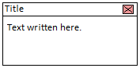
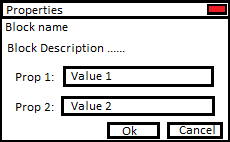

# Dialogs Behavior

## Shape
- rectangle shape, no round rects
- close button in the top right (could be removed)

## Drag Behavior
- dragging the top part moves the dialog
- drag can be cancelled with escape
- when dragging to side, always prevent any part of the dialog from disapearing

## Screen Resize Behavior
- dialog has fixed size, it will stay this size as long as possible.
- dialog has fixed position on screen, when the screen is too small it will move up and to left.
- provide a mode to fix the dialog in the center of the screen, for modal dialogs.
- when screen is too small to contain the widget it will shrink and display nothing in the middle
- when screen is too small the title will say "screen too small" and the X button.

## Properties Dialog
- multiple buttons (Ok, Cancel)
- Block name
- Block Description
- multiple properties, one after the other

