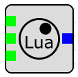

Lua Blocks
==========

You can write code for your custom blocks with the Lua programming language.

Some blocks have a ``Path`` property that points to a file in the ``LuaScripts`` directory, the ``Edit`` version of the blocks have a text editor you can access by double clicking the block, this is useful for portable blocks and web version of the application that don't have a file system. you can modify he code externally and paste it into the internal editor.

blocks have input and output count as properties, they are not detected from the code (yet).

Expression Block
----------------
You simply write the equation for the output into the ``Expression`` property.

For example ``t`` gives you an output that's a ramp that increases with time. likewise ``2 * t + 5`` gives you a line that starts from 5 with a slope of 2, you have access to lua math functions so ``math.sin(t)`` gives you a sine wave.

You can modify the inputs count, the inputs start from ``a`` for the first input and ``f`` for the sixth input. hence ``a * 2 + 5`` gives you out an output that's twice the input with an offset of 5

Nonlinear Block
---------------
this should have a function named ``apply`` with the following signature

.. code-block:: Lua

    function apply(input, output)
        -- your code here
    end

``input`` is a read-only ``span``, it is an array that you can only read from. and ``output`` is a span that you can write to it. the following shows how to write a block that has 2 inputs and 2 outputs, you must modify the block properties to have 2 inputs and 2 outputs.

.. code-block:: Lua

    function apply(input, output)
        output[1] = input[1] + input[2]
        output[2] = input[1] * input[2]
    end

Differential Block
------------------
this should have a function named ``apply`` wit the following signature

.. code-block:: Lua

    function apply(input, output, t)
        -- your code here
    end

like the Nonlinear block, the ``input`` is a read-only ``span``. 
``output`` is a ``span`` that represents the **Slope** of the output at the current time denoted by the input ``t``. 

This can be used to model time-dependent differential equations. the differential sovler produces accurate integrals of such derivatives. all differential outputs start from ``0``, a simple Integrator is as follows

.. code-block:: Lua

    function apply(input, output, t)
        output[1] = input[1]
    end

Stateful Block
--------------
this can have 5 functions, ``apply`` and ``update`` are mandatory, while ``setup`` and ``cross_trigger`` and ``event_trigger`` are optional.

.. code-lock:: Lua

    function apply(input, output, t, data)
        -- apply code here
    end

    function update(input, t, data)
        -- update code here
    end

    function setup(data)
        -- optionally setup here
    end

    function cross_trigger(t, index, data)
        -- optionally handle trigger here
    end

    function event_trigger(t, data)
        -- optionally handle trigger here
    end

``input`` and ``output`` are simlar to the Nonlinear block, with ``t`` representing the time of the evaluation, you can only modify ``output`` during ``apply``. 
``data`` is read-only in ``apply``, but modifyable in all other functions, it represents the following struct.

.. cpp:struct:: NLStatefulEquationData

    .. cpp:member:: std::vector<ZeroCrossDescriptor> crossings;

        a vector of zero crossings, handles zero crossing detection on inputs.

    .. cpp:member:: StatefulEquationEvent ev;

        represents time events, for example you want to get an ``update`` at exactly ``t=1``

.. cpp:struct:: ZeroCrossDescriptor

    .. cpp:member:: double value;
        
        value at which the simulation will trigger a zero crossing

    .. cpp:member:: int16_t in_port_id;
        
        id of the port for the zero crossing, starts from 0

    .. cpp:member:: CrossType type;
        
        ``CrossType.rising`` or ``CrossType.falling`` or ``CrossType.both``

    .. cpp:member:: Position last_value;
        
        ``CrossPosition.undefined`` or ``CrossPosition.above`` or ``CrossPosition.below``, defines the last state the socket was in before the current cross trigger

    .. cpp:member:: Position current_value;
       
        same as ``last_value`` defines the current state the socket was in before the current cross trigger

.. cpp:struct:: StatefulEquationEvent

    .. cpp:member:: bool enabled;

        whether the event is enabled and will trigger when the time comes
    .. cpp:member:: bool set;

        whether the event is currently happening

    .. cpp:member:: double t;

        the time at which the event will happen

* ``apply`` is called on every block evaluation to update the output.

* ``update`` is called every time a step is taken to give you an opporunity to update the internal state.

* ``setup`` is called once at the beginning of the simulation, it allows you to setup the thresholds and inital time for the event, you can skip it.

* ``cross_trigger`` is called once each time an input with a ``ZeroCrossDescriptor`` crosses the ``value`` threshold in the direction specified by ``type``. ``index`` is the index of the object in the vector of descriptors, not the port id.

* ``event_trigger`` is called at the time specified by ``data.ev.t`` if ``data.ev.enabled`` is ``true``, note that ``set`` is only true during ``event_trigger``.

the following code is for a derivative block written in Lua.

.. code-block:: Lua

    last_input_time = 0
    last_input = 0
    last_out = 0
    data_available = false

    function apply(input, output, t, data)
        if not data_available then
            output[1] = 0
            return
        end
        if t == last_out then
            output[1] = last_out
        else
            output[1] = (input[1] - last_input) / (t - last_input_time)
        end
        return
    end

    function update(input, t, data)
        if not data_available then
            data_available = true
            last_input = input[1]
            last_out = 0
            last_input_time = t
            return
        end
        last_out = (input[1] - last_input) / (t - last_input_time)
        last_input = input[1]
        last_input_time = t
        return
    end

this block is deliberately complex, it can be used to create the comparator block by adding zero crossing on the input, or it can create a square wave source by setting its stateful event to trigger at known times, **most of its funtionality is optional**.