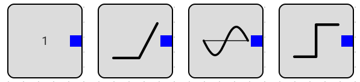
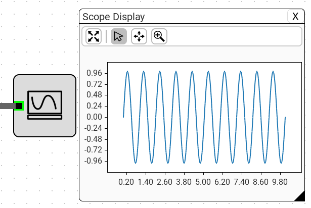
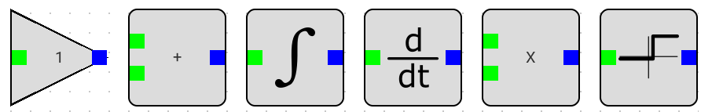
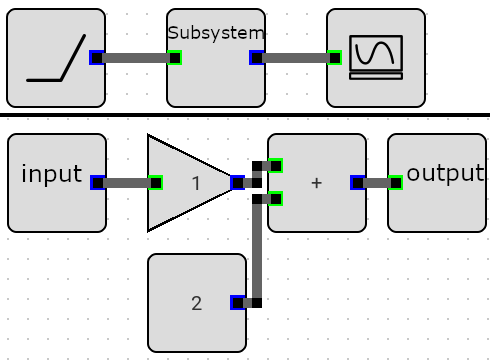

Builtin Blocks
##############

Sources
-------

#. **constant source**, its output is constant through the simulation, you can modify it in the properties.
#. **Ramp**, its output is simply ``C*time``, its intercept is zero, add it to a constant block if you want a non-zero intercept.
#. **Sine**, its output is given by ``sin(2 * pi * freq_hz + phase * pi / 180)``, for a cosine set its phase to 90.
#. **Step**, its output is ``Initial Value`` before the ``step time`` then ``Final Value`` after the step time, it has a finite controllable ``Rise Time``

Sinks
-----
currently only the **Scope** block is available, to preview the simulation results, the scope plot dialog has panning and zooming, you can also change the plot size by grabbing the resize grip in the lower right corner of the dialog.

Math Blocks
-----------

#. **Gain**, output is the input multiplied by a constant multiplier, you can modify it in the properties.
#. **Add**, its output is the sum of its inputs.
#. **Integration**, its output is the integral of its input, it starts at 0, and has no limits.
#. **Derivative**, its output is given by ``din/dt``, it takes the difference in the input between the last step and this step and divides it by the step duration. simulator steps have variable duration.
#. **Multiply**, its output is the multiplication of its two inputs.
#. **Comparator**, its output is ``1`` if the input is above a configurable ``threshold``, otherwise its output is ``0``, it has a finite configurable ``Rise Time``, to avoid convergence problems

Subsystem
---------

The main idea of a **Subsystem** is to group multiple blocks into a single block. once you add a subsystem block to the scene you can double click it to open it in a new tab.

the **Input** and **Output** blocks can be added **inside** the subsystem to add inputs and outputs to the subsystem. as you can see in the next example, a subsystem has an input and an output and applies a gain and an offset to it.

