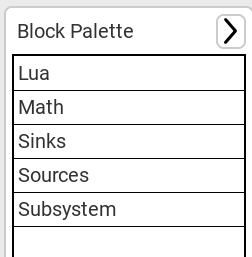

Getting Started
###############

first, download the latest verions, see the :doc:`installation section <installation>`.

Adding Blocks to Scene
----------------------

in the right corner, a button opens the block palette

.. image:: images/blocks_panel.png

this opens the block palette, click on any section you want to open, Sources blocks produce signals, Math blocks transform this signal, and Sinks block consume signals, currently a scope block is available that plots the signal on the screen.

you can add a block to the scene by **dragging it fom the palette** with left mouse button.

Modifying Blocks
----------------

Click on any block to select it then click on the properties button in the toolbar to modify the block properties, each property has a type, like integers or floating point numbers or text 

some blocks have special dialogs that you open by **double clicking** the block, if the block doesn't have a special dialog then the properties dialog is opened instead.
note that currently the scope block only plots the fist signal, and if there is no data then it shows a placeholder data for debugging, this is work-in-progress.

Connecting blocks
-----------------

Green sockets are inputs and Blue sockets are outputs, click on any input or output to start a new connection, and attach it to a corresponding input or output.

* hold down Ctrl button while clicking on the middle of a net segment to fork it.
* hold down shift while clicking on a block or net to delete it.

Running the Simulation
----------------------

the **Run Simulation** button in the toolbar runs the simulation, all sinks are updated once the simulation ends.

you can modify the simulation start and end time and the maximum simulation step in the settings dialog.

if the simulation fails, you will find an error message with the reason in the log that you can open with the button in the **lower left** of the screen.

