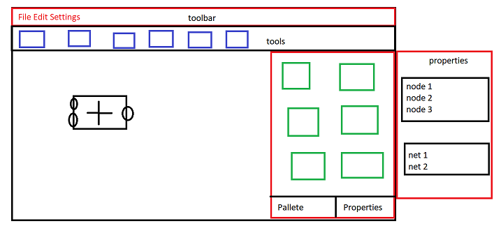

# Technical Specification

## GUI shape

GUI will contain

1. A toolBar
2. A tools Bar
3. A "Scene" in the middle
4. A "pallete" of nodes on the right to pick new nodes from
5. A Properties panel on the Right too.
6. both the Pallete and the properties windows will be in a tabbed window.

The properties window will contain

1. The Nodes in the scene.
2. the nets in the scene.

## User Interaction with pallete

pallete shows the nodes read from multiple libraries, there should be a way to add new libraries.

user can drag nodes from the pallete to the main scene, this will add the node of that type to the scene.

## User Interaction with the properties

maybe highlight nodes and nets when clicked, this needs more thought, mybe add a third window for properties and make this "elements" tab.

## User Tools

1. default tool
2. net tool
3. Hand tool
4. delete tool

### default tool

default tool should 

1. allow use to select one element (node or net segment)
2. allow moving nodes and net segments when dragging.
3. resize nodes if grabbing their side.
4. multiselect possible by dragging.

### net tool

used to add new nets and extend current ones.

### Hand tool

move the screen when dragging, potentially the middle mouse button can temporarily switch to this, there should also be a keyboard shortcut for this.

### delete tool

1. clicking on anything deletes it.
2. dragging creates an area where all elements will be deleted.

## Actions on selected objects

1. pressing ctrl allows the selection of more than one element.
2. pressing delete on keyboard will delete the current selected element if the Scene is in focus. (we need a way to keep track of user focus)
3. if the user drags while over an unselected object, all selected objects will be unselected and the current one selected and starts to be dragged.
4. if the user drags while over a selected object, all the selected objects will be dragged.

## User Interaction with Nodes

user should be able to

1. Move a node
2. resize a node
3. modify *some* of its properties (for example a ramp needs a variable rate), maybe through a "properties" panel.
4. Add the node from the pallete
5. Delete the node from the scene